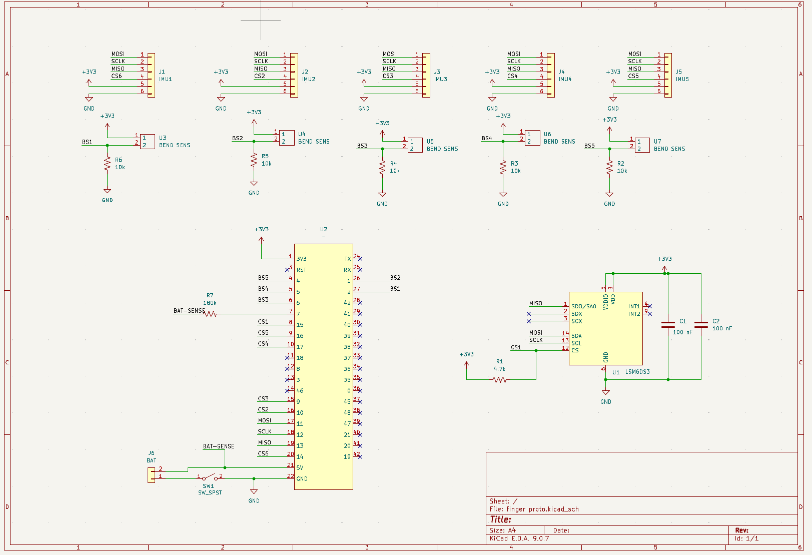
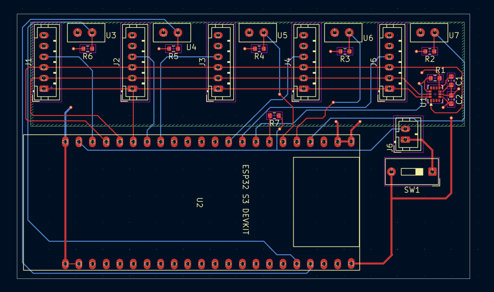
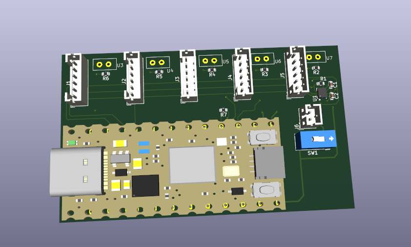

# finger-tracker-proto

Design for a PCB for moderately accurate hand and finger tracker. Would have connectors going to IMU breakout boards to determine fingertip position and bend sensors to determine how much each finger is bending, as well as an on board IMU for hand position.

Intended as a cheaper alternative to available high-end trackers for uses that don't require perfect accuracy. 

Not finished, probably won't end up finishing since its not worth the time it would take to create custom software, but wanted to upload so that anyone working on similar projects can take ideas from this. Keep in mind that for a real design, you would want to measure your fingers out and place the bend sensors accordingly, along with moving the thumb bend sensor and rotating it to a comfortable angle.

